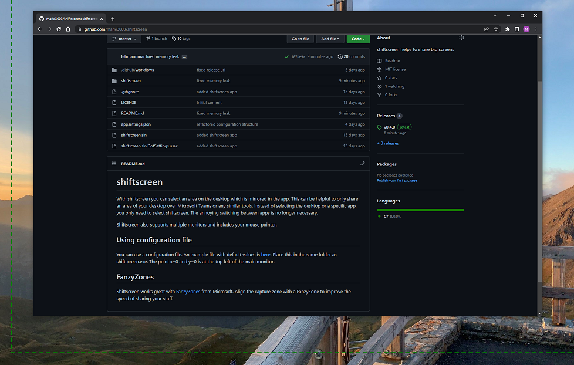

# shiftscreen
With shiftscreen you can select an area on the desktop which is mirrored in the app. This can be helpful to only share an area of your desktop over Microsoft Teams or any similar tools. Instead of selecting the desktop or a specific app, you only need to select shiftscreen. The annoying switching between apps is no longer necessary. 

Shiftscreen also supports multiple monitors and includes your mouse pointer.

**The app must be completely on the screen, but not necessarily in the foreground, otherwise it will not work**.

1. open Shiftscreen
2. select an area that you want to share on your screen
3. share Shiftscreen in Microsoft Teams

## Using configuration file
You can use a configuration file. An example file with default values is [here](appsettings.json). Place this in the same folder as shiftscreen.exe.
The point x=0 and y=0 is at the top left of the main monitor.

## FanzyZones
Shiftscreen works great with [FanzyZones](https://docs.microsoft.com/en-us/windows/powertoys/fancyzones) from Microsoft.
Align the capture zone with a FanzyZone to improve the speed of sharing your stuff.
